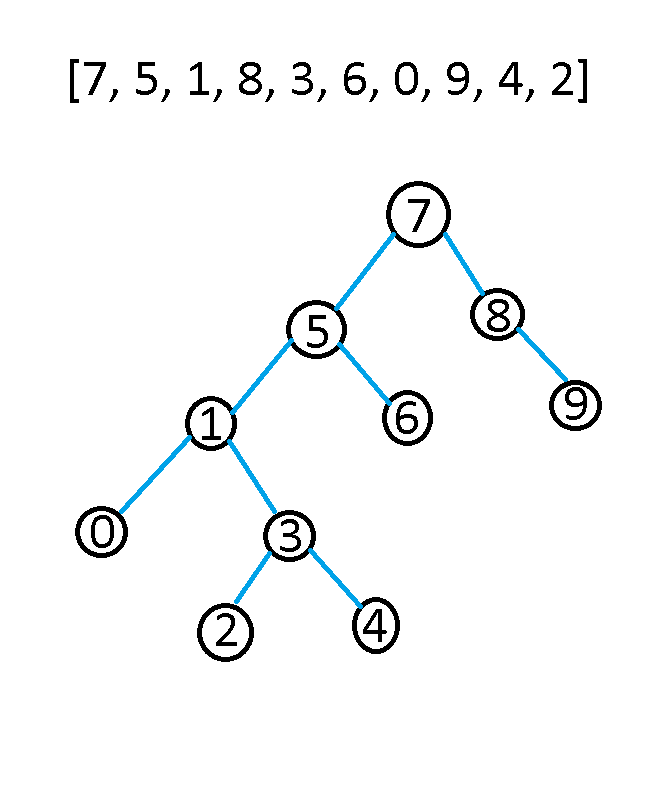

# [7, 5, 1, 8, 3, 6, 0, 9, 4, 2] dizisinin Binary-Search-Tree aşamalarını yazınız.
*Binary Search Treemizin ilk elemanı 7 olduğu için 7 sayısını en üste yazıyoruz, 7 den büyük olan sayıları sağına, küçük olan sayıları soluna yazarak her sayı için aynı işlemi yaparak ağacı oluşturuyoruz*

